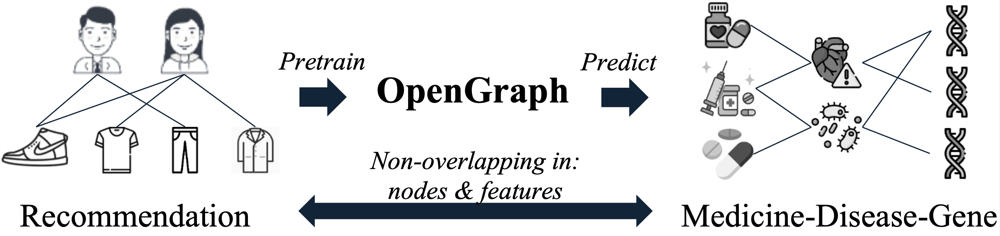
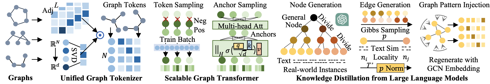
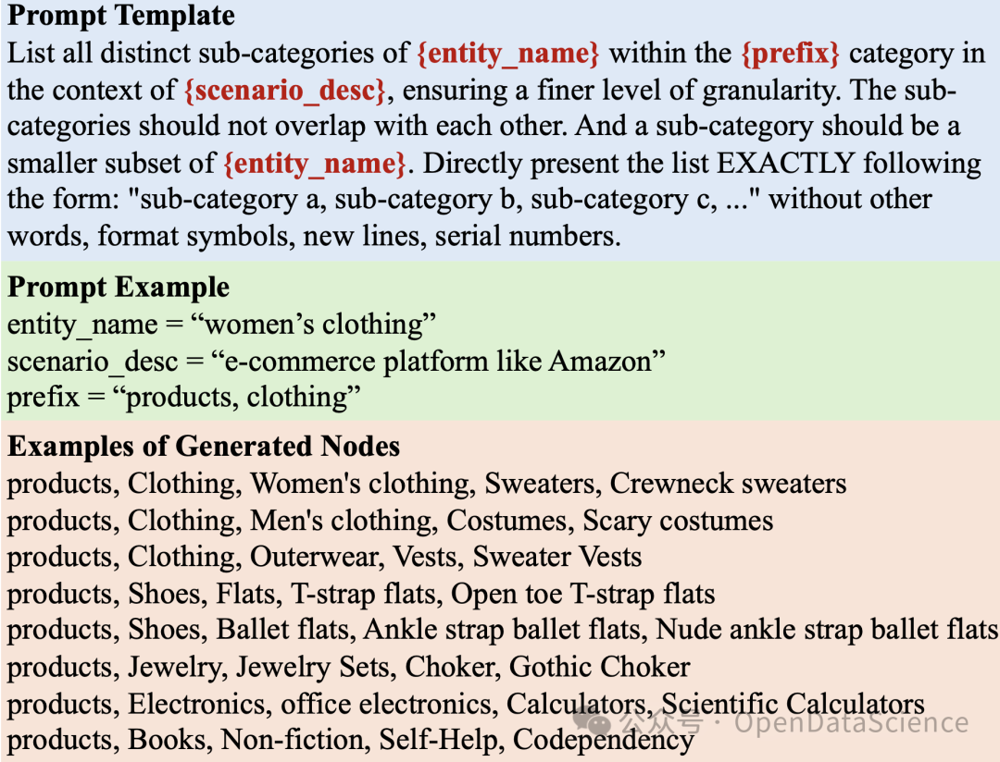
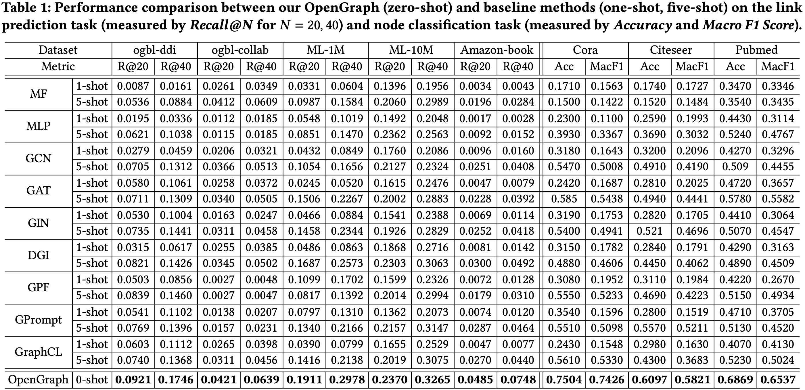
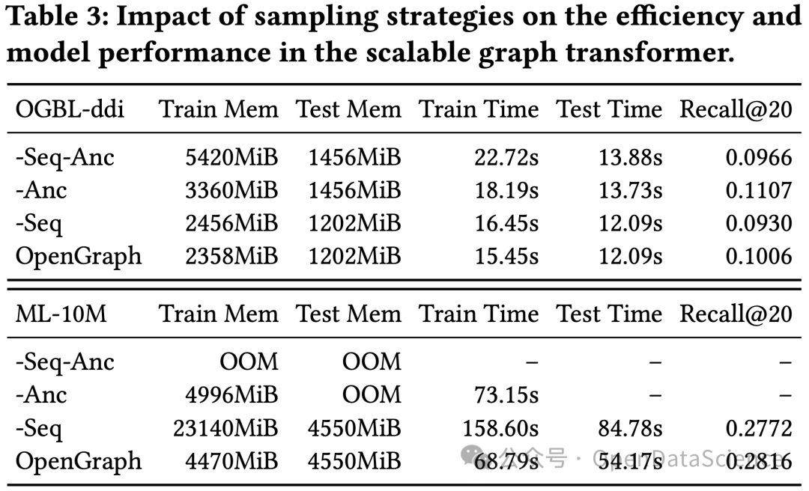

# OpenGraph: Towards Open Graph Foundation Models

<div align='center'>
<a href='https://arxiv.org/abs/2403.01121'></a>
<a href='https://mp.weixin.qq.com/s/nughdr2OQUGevdDzAQphjw'></a>
<a href='https://blog.csdn.net/weixin_43902773/article/details/136680880'></a>


<a href='https://akaxlh.github.io/'>Lianghao Xia</a>, <a href='https://scholar.google.com/citations?user=TwSParMAAAAJ'>Ben Kao</a>, and <a href='https://sites.google.com/view/chaoh/group-join-us'>Chao Huang*</a> (*Correspondence)


Presenting OpenGraph, a foundation graph model <b><i>distilling zero-shot graph generalizability from LLMs</i></b>.



</div>

To achieve this goal, OpenGraph addresses several key technical challenges:
- We propose a unified graph tokenizer to adapt our graph model to generalize well on unseen graph data, even when the underlying graph properties differ significantly from those encountered during training. 
- We develop a scalable graph transformer as the foundational encoder, which effectively and efficiently captures node-wise dependencies within the global topological context. 
- We introduce a data augmentation mechanism enhanced by a large language model (LLM) to alleviate the limitations of data scarcity in real-world scenarios.



Extensive experiments validate the effectiveness of our framework. By adapting OpenGraph to new graph characteristics and comprehending the nuances of diverse graphs, our approach achieves remarkable zero-shot graph learning performance across various settings and domains.

## Environment Setup
You need to unzip some of the data files in `datasets/`. Download the pre-trained models using the link in `Models/readme`. Our experiments were conducted with the following package versions:
* python==3.10.13
* torch==1.13.0
* numpy==1.23.4
* scipy==1.9.3

## Brief Code Structure
Here is a brief overview of the code structures. The explanations for each directory are enclosed in quotes (##...##). For a more detailed version, please refer to the full version listed at the end of this readme.
```
./
│   └── README.md
│   ├── History/ ## Training history of pre-trained models ##
│   ├── Models/ ## Pre-trained models ##
│   ├── datasets/
│   ├── graph_generation/ ## Code and examples for graph generation ##
│   ├── imgs/ ## Images used in readme ##
│   ├── link_prediction/ ## code for link prediction and pre-training ##
│   │   ├── data_handler.py
│   │   ├── main.py
│   │   ├── model.py
│   │   └── params.py
│   │   ├── Utils/
│   │   │   └── TimeLogger.py
│   ├── node_classification/ ## code for testing on node classification ##
│   │   ├── data_handler.py
│   │   ├── main.py
│   │   ├── model.py
│   │   └── params.py
│   │   ├── Utils/
│   │   │   └── TimeLogger.py
```

## Usage
#### To reproduce the test performance reported in the paper, run the following command lines:
```
cd link_prediction/
python main.py --load pretrn_gen1 --epoch 0 # test on OGBL-Collab, ML-1M, ML-10M
python main.py --load pretrn_gen0 --tstdata amazon-book --epoch 0 # test on Amazon-Book
python main.py --load pretrn_gen2 --tstdata ddi --epoch 0 # test on OGBL-ddi
cd ../node_classification/
python main.py --load pretrn_gen1 --tstdata cora # test on Cora
python main.py --load pretrn_gen1 --tstdata citeseer # test on Citeseer
python main.py --load pretrn_gen1 --tstdata pubmed # test on Pubmed
```

#### To re-pretrain OpenGraph by yourself, run the following command lines:
```
cd ../link_prediction/
python main.py --save pretrn_gen1
python main.py --trndata gen0 --tstdata amazon-book --save pretrn_gen0
python main.py --trndata gen2 --tstdata ddi --save pretrn_gen2
```

#### To explore pretraining with multiple different pre-training and testing datasets, modify `trn_datasets` and `tst_datasets` in line 241 of `link_prediction/main.py`.

## Graph Data Generation
The graph generation code is in `graph_generation/`. A toy dataset of small size is given. You need to fill in your OpenAI key in `Utils.py` and `itemCollecting_dfsIterator.py` first. To generate your dataset, modify the `descs` and `hyperparams` dicts, and follow the following procedure:
```
cd graph_generation/
python itemCollecting_dfsIterator.py
python instance_number_estimation_hierarchical.py
python embedding_generation.py
python human_item_generation_gibbsSampling_embedEstimation.py
python make_adjs.py
```

Below shows our prompt template, as well as examples for prompt configurations and generated nodes.



## Evaluation Results

### Overall Generalization Performance
OpenGraph achives best performance under the 0-shot setting, compared to baselines trained/tuned with 1-shot and 5-shot data.


### Pre-training Dataset Study
We studied the influence of using different pre-training datasets. Results below indicate that:
- The generation techniques (Norm, Loc, Topo) have positive effects on performance.
- Real-world datasets (Yelp2018, Gowalla) may yield worse results compared to our generated ones.
- A relevant pre-training dataset (ML-10M for test data ML-1M and ML-10M) results in superior performance.


### Graph Tokenizer Study
We tuned configurations of our unified graph tokenizer, by adjusting the order of graph smoothing, and replacing our topology-aware projection with alternatives. Our findings include:
- **Adjacency smoothing is important**, as OpenGraph with 0-order smoothing yields inferior performance.
- **Topology-aware projection is superior in performance**. Alternatives include *One-hot* which learns a big and unified representation table for all datasets, *Random* which holds no assumption for the node-wise relations and distributes them uniformly, *Degree* which is a widely-used method for non-attributed graphs and seems applicable for cross-graph scenario.


### Sampling Techniques Study
We ablated the two sampling techniques in the graph transformer, and show their positive effects on both memory and time costs below. Suprisingly, token sequence sampling shows a positive effect over the model performance.



## Citation
If you find this work useful for your research, please consider citing our paper:
```
@article{xia2024opengraph,
  title={OpenGraph: Towards Open Graph Foundation Models},
  author={Xia, Lianghao and Kao, Ben and Huang, Chao},
  journal={arXiv preprint arXiv:2403.01121},
  year={2024}
}
```

## Detailed Code Structures
```
./
│   └── README.md
│   ├── History/ ## Training history of pre-trained models ##
│   │   ├── pretrn_gen0.his
│   │   ├── pretrn_gen2.his
│   │   └── pretrn_gen1.his
│   ├── Models/ ## Pre-trained models ##
│   │   └── readme ## Download pre-trained models using the link inside ##
│   ├── datasets/
│   │   ├── amazon-book/
│   │   │   ├── fewshot_mat_1.pkl
│   │   │   ├── trn_mat.pkl.zip ## Unzip it manually ##
│   │   │   ├── tst_mat.pkl
│   │   │   └── fewshot_mat_5.pkl
│   │   ├── citeseer/
│   │   │   ├── adj_-1.pkl
│   │   │   ├── adj_1.pkl
│   │   │   ├── adj_5.pkl
│   │   │   ├── feats.pkl.zip ## Unzip it manually ##
│   │   │   ├── label.pkl
│   │   │   ├── mask_-1.pkl
│   │   │   ├── mask_1.pkl
│   │   │   └── mask_5.pkl
│   │   ├── collab/
│   │   │   ├── fewshot_mat_5.pkl
│   │   │   ├── trn_mat.pkl.zip ## Unzip it manually ##
│   │   │   ├── tst_mat.pkl
│   │   │   ├── val_mat.pkl
│   │   │   └── fewshot_mat_1.pkl
│   │   ├── cora/
│   │   │   ├── adj_-1.pkl
│   │   │   ├── adj_1.pkl
│   │   │   ├── adj_5.pkl
│   │   │   ├── feats.pkl
│   │   │   ├── label.pkl
│   │   │   ├── mask_-1.pkl
│   │   │   ├── mask_1.pkl
│   │   │   └── mask_5.pkl
│   │   ├── ddi/
│   │   │   ├── fewshot_mat_1.pkl
│   │   │   ├── trn_mat.pkl.zip ## Unzip it manually ##
│   │   │   ├── tst_mat.pkl
│   │   │   ├── val_mat.pkl
│   │   │   └── fewshot_mat_5.pkl
│   │   ├── gen0/
│   │   │   ├── trn_mat.pkl
│   │   │   ├── val_mat.pkl
│   │   │   └── tst_mat.pkl
│   │   ├── gen1/
│   │   │   ├── trn_mat.pkl
│   │   │   ├── tst_mat.pkl
│   │   │   └── val_mat.pkl
│   │   ├── gen2/
│   │   │   ├── trn_mat.pkl
│   │   │   ├── val_mat.pkl
│   │   │   └── tst_mat.pkl
│   │   ├── ml10m/
│   │   │   ├── fewshot_mat_1.pkl
│   │   │   ├── trn_mat.pkl.zip ## Unzip it manually ##
│   │   │   ├── tst_mat.pkl.zip ## Unzip it manually ##
│   │   │   └── fewshot_mat_5.pkl
│   │   ├── ml1m/
│   │   │   ├── fewshot_mat_5.pkl
│   │   │   ├── trn_mat.pkl
│   │   │   ├── tst_mat.pkl
│   │   │   └── fewshot_mat_1.pkl
│   │   ├── pubmed/
│   │   │   ├── adj_-1.pkl
│   │   │   ├── adj_1.pkl
│   │   │   ├── feats.pkl.zip ## Unzip it manually ##
│   │   │   ├── label.pkl
│   │   │   ├── mask_-1.pkl
│   │   │   ├── mask_1.pkl
│   │   │   ├── mask_5.pkl
│   │   │   └── adj_5.pkl
│   ├── graph_generation/ ## Code and examples for graph generation ##
│   │   ├── embedding_generation.py ## Node embedding generation ##
│   │   ├── human_item_generation_gibbsSampling_embedEstimation.py ## Edge generation ##
│   │   ├── instance_number_estimation_hierarchical.py ## Estimate amount for each node. Not mentioned in the paper. ##
│   │   ├── itemCollecting_dfsIterator.py ## Node generation ##
│   │   ├── make_adjs.py ## Making datasets for generated gaphs ##
│   │   └── Utils.py
│   │   ├── Exp_Utils/
│   │   │   ├── Emailer.py ## A tool to send warning email for experiments ##
│   │   │   └── TimeLogger.py
│   │   ├── gen_results/
│   │   │   ├── tree_wInstanceNum_products_e-commerce platform like Amazon.pkl ## Tree data structure ##
│   │   │   └── products_e-commerce platform like Amazon.txt ## Node list ##
│   │   │   ├── datasets/
│   │   │   │   ├── gen_data_ecommerce/
│   │   │   │   │   ├── embedding_dict.pkl
│   │   │   │   │   ├── item_list.pkl
│   │   │   │   │   └── interaction_base-0_iter-0.pkl ## generated edges ##
│   │   │   │   │   ├── res/
│   │   │   │   │   │   ├── iter-0_imap.pkl ## Id map for nodes ##
│   │   │   │   │   │   ├── iter-0_test.pkl
│   │   │   │   │   │   ├── iter-0_train.pkl
│   │   │   │   │   │   ├── iter-0_valid.pkl
│   │   │   │   │   │   └── interaction_fuse_iter-0.pkl
│   │   │   ├── tem/ ## Temporary files for node generation ##
│   │   │   │   ├── e-commerce platform like Amazon_depth1_products
│   │   │   │   ├── e-commerce platform like Amazon_depth2_products, Automotive
│   │   │   │   ├── e-commerce platform like Amazon_depth2_products, Baby
│   │   │   │   ├── e-commerce platform like Amazon_depth2_products, Beauty
│   │   │   │   ├── e-commerce platform like Amazon_depth2_products, Books
│   │   │   │   ├── e-commerce platform like Amazon_depth2_products, Clothing
│   │   │   │   ├── e-commerce platform like Amazon_depth2_products, Electronics
│   │   │   │   ├── e-commerce platform like Amazon_depth2_products, Handmade
│   │   │   │   ├── e-commerce platform like Amazon_depth2_products, Health and Personal Care
│   │   │   │   ├── e-commerce platform like Amazon_depth2_products, Home Improvement
│   │   │   │   ├── e-commerce platform like Amazon_depth2_products, Industrial and Scientific
│   │   │   │   ├── e-commerce platform like Amazon_depth2_products, Jewelry
│   │   │   │   ├── e-commerce platform like Amazon_depth2_products, Musical Instruments
│   │   │   │   ├── e-commerce platform like Amazon_depth2_products, Office Products
│   │   │   │   ├── e-commerce platform like Amazon_depth2_products, Pet Supplies
│   │   │   │   ├── e-commerce platform like Amazon_depth2_products, Tools and Home Improvement
│   │   │   │   ├── e-commerce platform like Amazon_depth2_products, Toys
│   │   │   │   └── e-commerce platform like Amazon_depth2_products, Sports and Outdoors
│   ├── imgs/ ## Images used in readme ##
│   │   ├── framework.png
│   │   ├── intro.png
│   │   ├── performance.png
│   │   └── article cover.jpg
│   ├── link_prediction/ ## code for link prediction and pre-training ##
│   │   ├── data_handler.py
│   │   ├── main.py
│   │   ├── model.py
│   │   └── params.py
│   │   ├── Utils/
│   │   │   └── TimeLogger.py
│   ├── node_classification/ ## code for testing on node classification ##
│   │   ├── data_handler.py
│   │   ├── main.py
│   │   ├── model.py
│   │   └── params.py
│   │   ├── Utils/
│   │   │   └── TimeLogger.py
```
